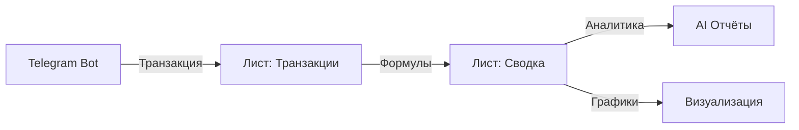

<div align="center">

# Finans Nova

### Telegram-бот для учёта финансов с голосовым вводом и AI-категоризацией

[](https://python.org)
[](https://core.telegram.org/bots)
[](LICENSE)
[](https://github.com/zavet-g/finans-nova)


</div>

---

<div align="center">

[](https://git.io/typing-svg)

</div>

## Суть проекта

Говоришь или пишешь — бот распознаёт, категоризирует и сохраняет транзакции в Google Sheets. Whisper STT локально, YandexGPT для AI-анализа, автоматические отчёты с графиками.

```
Голос/Текст → Whisper → YandexGPT → Подтверждение → Google Sheets
```

## Технологии

<div align="center">


</div>

**Core:** python-telegram-bot • OpenAI Whisper • YandexGPT • Google Sheets API • matplotlib • APScheduler

## Возможности

<table>
<tr>
<td width="50%">

### 🎤 Распознавание речи
- Whisper STT (модель medium)
- Локальная обработка
- Поддержка OGG/WAV

### 🤖 AI-анализ
- YandexGPT категоризация
- Контекстное понимание
- Fallback на keywords

</td>
<td width="50%">

### 📊 Аналитика
- Круговые и столбчатые графики
- AI-отчёты по периодам
- Сравнение с прошлыми месяцами

### 💾 Экспорт данных
- CSV-формат
- Автоматические отчёты по расписанию
- Интеграция с Google Sheets

</td>
</tr>
</table>

**Интерактивное редактирование** • **Множественные транзакции** • **Приватность данных** • **Production-ready**

## Быстрый старт

### Требования

- Python 3.11+
- FFmpeg
- Google Service Account

### Локальный запуск

```bash
pip install -r requirements.txt
cp .env.example .env
python src/main.py
```

### Docker

```bash
docker compose up -d
# или используйте Makefile
make run
make logs
make stop
```

### Переменные окружения

```bash
TELEGRAM_BOT_TOKEN=             # BotFather токен
YANDEX_GPT_API_KEY=             # Yandex Cloud API ключ
YANDEX_GPT_FOLDER_ID=           # Yandex Cloud folder ID
GOOGLE_SHEETS_CREDENTIALS_FILE= # путь к service_account.json
GOOGLE_SHEETS_SPREADSHEET_ID=   # ID таблицы
ALLOWED_USER_IDS=               # список user_id через запятую
```

## Архитектура

```
src/
├── bot/
│   ├── handlers/      # voice, text, callbacks, menu
│   ├── keyboards.py   # inline-клавиатуры
│   └── states.py      # состояния ConversationHandler
├── services/
│   ├── speech.py      # Whisper STT
│   ├── ai_analyzer.py # YandexGPT
│   ├── sheets.py      # Google Sheets CRUD
│   ├── charts.py      # matplotlib графики
│   └── scheduler.py   # APScheduler
├── models/
│   ├── transaction.py # Pydantic модель
│   └── category.py    # категории
└── utils/
    ├── audio.py       # FFmpeg конвертация
    └── formatters.py  # форматирование сообщений
```

### Google Sheets структура

<div align="center">



</div>

Автоматически создаются 2 листа:

- **Транзакции** — мастер-лог с автоматическим расчётом баланса
- **Сводка** — статистика текущего месяца, расходы по категориям, формулы SUMIFS

## Почему это работает

<table>
<tr>
<td align="center" width="33%">

<br>
<b>Контекстная AI</b>
<br>
<sub>YandexGPT понимает контекст:<br>"такси до работы" → категория Такси,<br>описание "До работы"</sub>
</td>
<td align="center" width="33%">

<br>
<b>Приватность</b>
<br>
<sub>Whisper работает локально,<br>данные только в вашем<br>Google Sheets</sub>
</td>
<td align="center" width="33%">

<br>
<b>Batch обработка</b>
<br>
<sub>"обед 400, кофе 250, такси 500"<br>→ три отдельные записи<br>с правильными категориями</sub>
</td>
</tr>
</table>

**Локальный Whisper** — приватность данных, нет зависимости от внешних STT API.

**Множественные транзакции** — "обед 400, кофе 250, такси 500" → три отдельные записи с правильными категориями.

**Fallback-стратегия** — если YandexGPT недоступен, работает категоризация по ключевым словам.

## Production-оптимизация

Бот оптимизирован для непрерывной работы месяцами без деградации производительности.

<table>
<tr>
<td width="50%">

### ⚡ Производительность
- HTTP connection pooling для API
- Async Google Sheets executor
- Exponential backoff retry
- Таймауты: <1% запросов

### 🛡️ Надёжность
- Circuit breaker для API
- Rate limiting (20 req/min)
- Global error handling
- Graceful degradation

</td>
<td width="50%">

### 📊 Мониторинг
- Health check система
- Uptime, память, CPU
- Error rate tracking
- Resource monitoring с auto-GC

### 📝 Логирование
- Structured logging
- Rotation (10MB, 5 backups)
- Отдельный error.log
- Метрики производительности

</td>
</tr>
</table>

**Команды мониторинга:**
- `/health` — детальный статус бота, ресурсов, API
- `/stats` — краткая статистика запросов
- Кнопка "🔧 Состояние бота" в главном меню

<div align="center">


</div>

## Статистика

<div align="center">

[](https://github.com/zavet-g/finans-nova/stargazers)
[](https://github.com/zavet-g/finans-nova/network/members)
[](https://github.com/zavet-g/finans-nova/issues)

</div>
